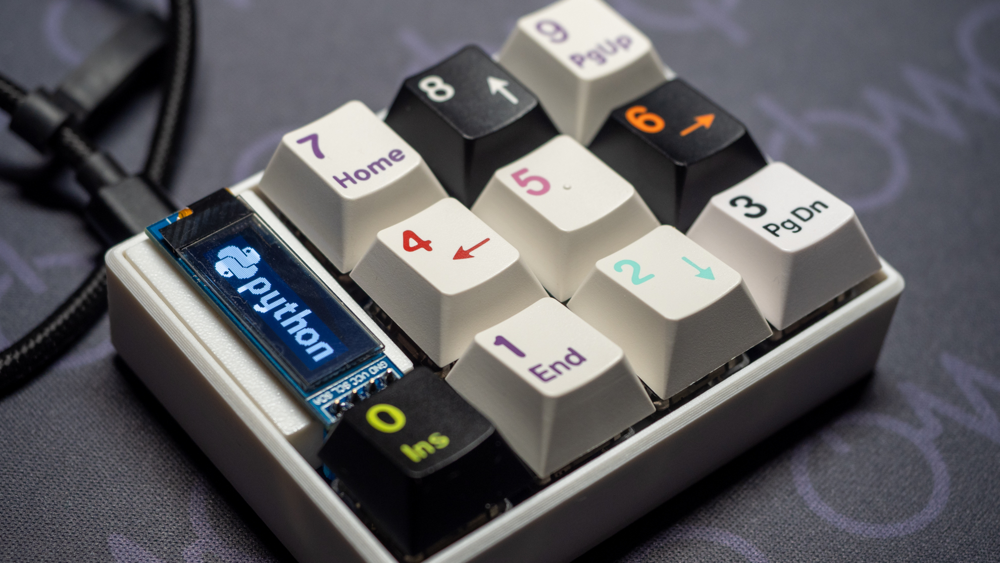

# Making a keyboard using only Python.

> This is day 20 of [Keyboard #1 Advent Calendar 2022](https://adventar.org/calendars/7529).    
> The article yesterday was [コンスルーピンヘッダの代わりを探して](https://74th.hateblo.jp/entry/2022/12/19/124809) by 74th.

Hello. I'm [hsgw](https://twitter.com/hsgw).   
Every year I post useful tips for the advent calendar post.

This year I will introduce how to design a keyboard using only Python without using kicad or 3DCAD.

# TL;DR
※ PCB, case, and firmware data are not guaranteed. Please let me know if there are any mistakes.

PCB, case, and firmware data are not guaranteed. Please let me know if there are any mistakes.

- Design not only the firmware, but also the schematic (netlist), PCB, and case all in Python.   
- Mainly introduce the design flow (please read the documentation and source code for the detailed)
- The code will be explained in a runnable jupyter notebook (google colaboratory) environment.   
- The libraries to be used are as follows

|  Purpose   |library|
|------------|-----|
|Circuit     |[skidl](https://github.com/devbisme/skidl)|
|PCB         |[pcbflow](https://github.com/michaelgale/pcbflow) ([my folk](https://github.com/hsgw/pcbflow/tree/fix_kicad))|
|Case        |[cadquery](https://github.com/CadQuery/cadquery)|
|Firmware    |[KMK Firmware](https://github.com/KMKfw/kmk_firmware), [circuitpython](https://circuitpython.org/)|

# Why make a keyboard in Python?
[Python](https://www.python.org/) is a programming language. It is designed with a focus on creating useful programs that are easy to write and read.

Of course, it can be extended with all kinds of libraries to create not only computer-like behaviors such as complex calculations, image processing, and machine learning, but also games, music, pictures, and anything else you can want to create.
Python is used in almost anything that has the name "AI", and the image generation AI that has been making the rounds recently is also running in Python.

There are also libraries for drawing schematics, wiring PCBs, creating 3D models, and even running microcontrollers in Python.

The advantage of `designing something` by `writing code`, not just Python, is that the design is character-based information.
It can be understood and designed using only a text editor without special things (schematic symbols, etc.) to be aware of.
When you collaborate with someone else, you can use git's powerful version control and diff extraction, so it is easy to do so.

And since the code for the design is a program, let the computer do the complex calculations and repetition of the same values and sections. It is less mistake and easier to make changes.

# Code and Instructions
Click on the link below to open the code and instructions that can be run on google colaboratory.

The case section uses [binder](https://mybinder.org) for environmental reasons. This is a similar runtime environment.

- [What is google colaboratory](https://colab.research.google.com/github/hsgw/keyboard-made-by-python/blob/main/notebook/en/what_is_colaboratory.ipynb)
- [Design PCB](https://colab.research.google.com/github/hsgw/keyboard-made-by-python/blob/main/notebook/en/pcb.ipynb)
- [Design case](https://mybinder.org/v2/gh/hsgw/keyboard-made-by-python/HEAD?labpath=notebook%2Fen%2Fcase.ipynb) * [binder](https://mybinder.org). It may take some time to display.
- [Create firmware](firmware.md) 

# Impressions
It was possible to design the entire project, including the hardware, using only Python.   
Especially netlist design with skidl and 3D modeling with cadquery can be done parametrically and are easy to write and understand, so there will be many uses in the future.   
I recommend a workflow that reads the skidl netlist into kicad's pcbnew because pcbflow seems to be out of development, has many restrictions, and is difficult to preview.

# Lastly.
It has been a busy year and the only keyboard project I did this year was shipping Lain's GB. Next year, I hope to be able to relax and design keyboards since both the semiconductor/component shortage and the weak yen seem to be over.    
Have a great New Year!

// This article was written by casasagi+3D printed case